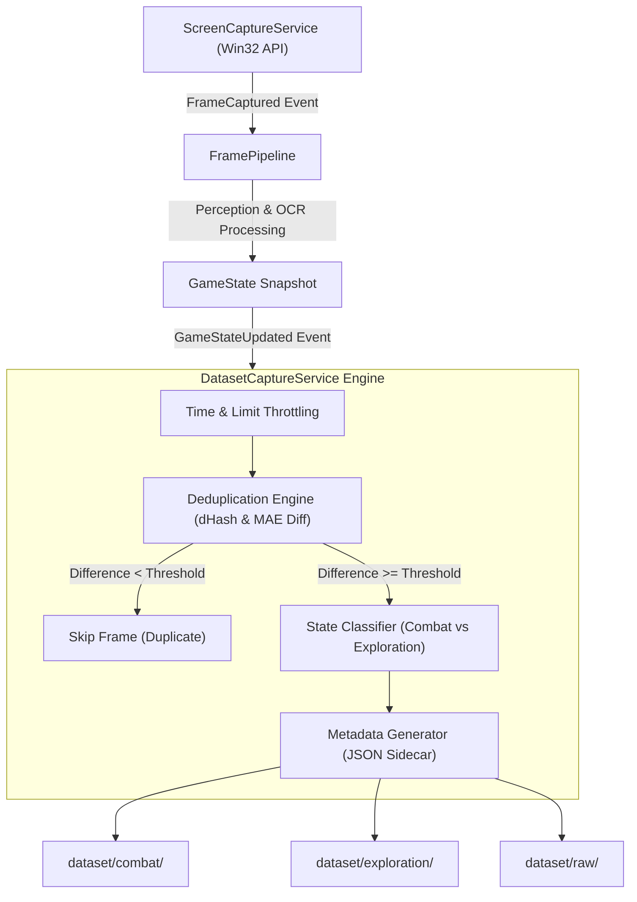

# Automated Dataset Generation & YOLOv8 Preparation Guide

## 1. Overview & Architecture

The **Dataset Generation Pipeline** is designed to automatically harvest, deduplicate, classify, and annotate raw game frames during live execution of the **Dofus Tactical Assistant (DTA)**. 

Moving from rule-based computer vision (HSV color segmentation, contour heuristics, morphological filtering) to deep learning object detection (YOLOv8) requires thousands of high-quality, diverse game screenshots. This module bridges live perception and offline dataset preparation seamlessly without impairing real-time bot performance.

### System Flow Diagram



---

## 2. Directory Structure

Captured frames and their sidecar metadata files are organized into standard directories under the `dataset/` root:

```text
dataset/
├── raw/          # Unfiltered secondary archive of all captured frames
├── combat/       # Frames captured during active combat sessions
├── exploration/  # Frames captured during map navigation and outdoor movement
└── validation/   # Reserved for curated benchmark evaluation sets
```

### File Naming Convention
Each captured sample generates two synchronized files:
- **Image**: `frame_{TIMESTAMP}_{FRAME_ID}.png`
- **Metadata**: `frame_{TIMESTAMP}_{FRAME_ID}.json`

---

## 3. Metadata JSON Schema

For every saved image, `DatasetCaptureService` outputs a structured JSON sidecar containing perception metadata:

```json
{
  "timestamp": "2026-09-07T15:20:00.123456+00:00",
  "frame_id": "frame_000123",
  "combat": true,
  "resolution": [1920, 1080],
  "pa": 11,
  "pm": 6,
  "hp": 5279,
  "detected_entities": 4,
  "phash": "a1b2c3d4e5f67890",
  "frame_difference": 0.1425
}
```

---

## 4. Configuration & Activation

The dataset capture engine is fully configurable via `config.yaml` or programmatically through `Settings`.

### `config.yaml` Example
```yaml
dataset:
  enabled: true                    # Toggle automatic capture on/off
  save_interval_seconds: 2.0       # Time threshold between saved frames
  max_images_per_session: 5000     # Maximum total frames per run
  min_frame_difference: 0.05       # Deduplication sensitivity threshold (0.0 to 1.0)
  dataset_dir: "dataset"           # Root target output folder
  save_raw: true                   # Also maintain raw/ directory copy
```

---

## 5. Deduplication & Classification Algorithms

### Perceptual Hashing (dHash) & Structural Difference
To prevent filling storage with hundreds of identical idle frames when standing still at a bank or waiting for a turn:
1. **Difference Hash (dHash)**: Computes a 64-bit perceptual hash by resizing the frame to $9 \times 8$ grayscale and comparing adjacent pixel gradients.
2. **Mean Absolute Error (MAE)**: Calculates normalized structural difference between consecutive frames resized to $64 \times 64$. If $\text{MAE} < \text{min\_frame\_difference}$, the frame is discarded as a duplicate.

### Combat vs. Exploration State Classification
`DatasetCaptureService` inspects the live `GameState` snapshot:
- **Combat Active (`combat: true`)**: Detected if `pa > 0` or `pm > 0` in HUD OCR, if `combat_state` is active, or if `combat_base` selection rings are detected under entities.
- **Exploration (`combat: false`)**: Detected when outside active turn sessions.

---

## 6. Dataset Validation Mode & Analytics

### Real-Time Session Metrics & `dataset/report.json`
`DatasetCaptureService` tracks live execution metrics during bot operation:
- `total_frames_seen`: Total frames received from pipeline
- `total_frames_saved`: Samples written to disk
- `duplicate_frames_skipped`: Near-identical frames skipped by deduplication
- `combat_frames_saved`: Combat category sample count
- `exploration_frames_saved`: Exploration category sample count
- `average_frame_difference`: Running average structural difference

When a capture session terminates (`stop_listening()`), `dataset/report.json` is generated automatically:

```json
{
  "session_start_time": "2026-09-07T15:45:00.000000+00:00",
  "session_end_time": "2026-09-07T15:47:00.000000+00:00",
  "duration_seconds": 120.0,
  "metrics": {
    "total_frames_seen": 1500,
    "total_frames_saved": 450,
    "duplicate_frames_skipped": 1050,
    "combat_frames_saved": 300,
    "exploration_frames_saved": 150,
    "average_frame_difference": 0.1245
  }
}
```

### Dataset Analysis CLI (`scripts/analyze_dataset.py`)
To inspect dataset health, class distribution, resolution breakdown, and OCR metrics, run:

```bash
python scripts/analyze_dataset.py --dataset-dir dataset
```

#### Output Example:
```text
============================================================
           DOFUS 3 BOT - DATASET ANALYSIS REPORT           
============================================================
Dataset Root Directory : C:\Users\Andres\Desktop\bot\dataset
Total Saved Images     : 450
Total Metadata Files   : 450
Unique Perceptual Hashes: 412

------------------------------------------------------------
 CATEGORY BREAKDOWN
------------------------------------------------------------
  • combat       :   300 images |   300 jsons
  • exploration  :   150 images |   150 jsons
  • raw          :   450 images |   450 jsons
  • validation   :     0 images |     0 jsons

------------------------------------------------------------
 STATE DISTRIBUTION
------------------------------------------------------------
  • Combat      :   300 samples ( 66.7%)
  • Exploration :   150 samples ( 33.3%)

------------------------------------------------------------
 OCR & PERCEPTION METRICS (AVERAGES)
------------------------------------------------------------
  • Average PA           : 11.0
  • Average PM           : 6.0
  • Average HP           : 5279.0
  • Avg Entities / Frame : 3.45
  • Avg Frame Difference : 0.1245
============================================================
```

---

## 7. Guide: Preparing the Dataset for YOLOv8 Training

Once thousands of frames have been collected automatically, follow these steps to label and convert the dataset into YOLOv8 format:

### Step 1: Exporting to Annotation Tools (Label Studio / CVAT / Roboflow)
1. Import images from `dataset/combat/` and `dataset/exploration/` into your preferred labeling tool (e.g. **Label Studio** or **CVAT**).
2. Define target classes for Dofus 3 object detection:
   - `player`
   - `ally`
   - `enemy`
   - `puch`
   - `interactive_resource`

### Step 2: YOLO Segmentation / Bounding Box Format
YOLOv8 expects text files (`.txt`) for each image with normalized bounding box coordinates:

$$\text{class\_id} \quad x_{\text{center}} \quad y_{\text{center}} \quad \text{width} \quad \text{height}$$

Where $x_{\text{center}}, y_{\text{center}}, \text{width}, \text{height}$ are normalized in range $[0.0, 1.0]$ relative to image width and height.

### Step 3: Dataset Directory Layout for Ultralytics YOLOv8
Organize exported annotations into standard YOLO train/val splits:

```text
yolov8_dofus_dataset/
├── dataset.yaml
├── images/
│   ├── train/
│   │   ├── frame_001.png
│   │   └── ...
│   └── val/
│       ├── frame_050.png
│       └── ...
└── labels/
    ├── train/
    │   ├── frame_001.txt
    │   └── ...
    └── val/
        ├── frame_050.txt
        └── ...
```

### `dataset.yaml` Example
```yaml
path: ./yolov8_dofus_dataset
train: images/train
val: images/val

names:
  0: player
  1: ally
  2: enemy
  3: puch
  4: interactive_resource
```

### Step 4: Training YOLOv8 Command
```bash
yolo detect train data=dataset.yaml model=yolov8n.pt epochs=100 imgsz=640 batch=16
```
